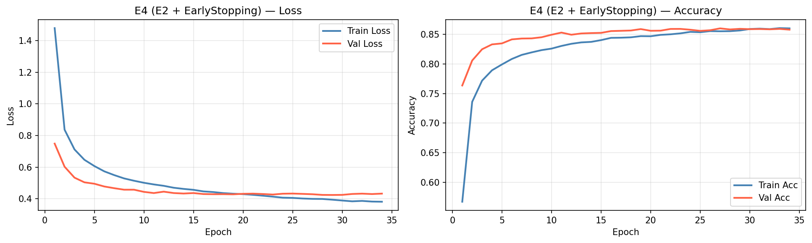
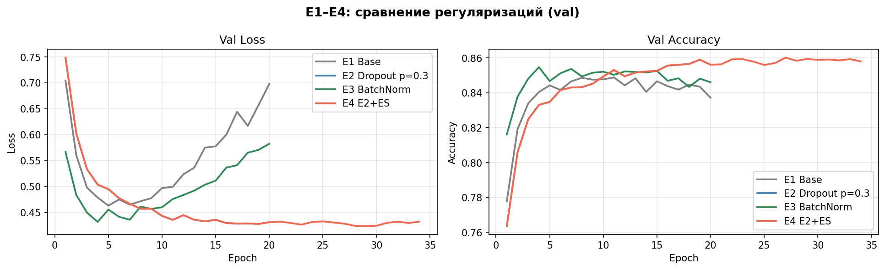
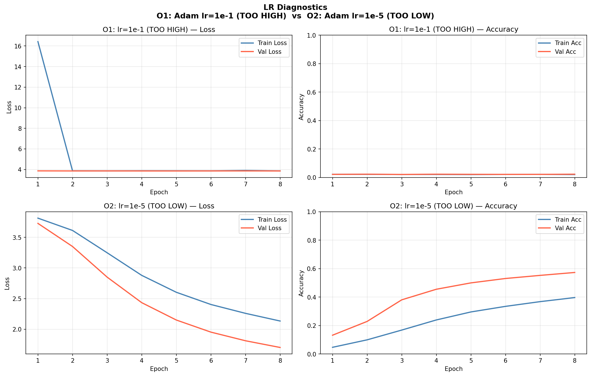

# Отчёт HW08-09: MLP, регуляризация и оптимизация

**Датасет:** EMNIST `split="balanced"` (Вариант B)  
**Seed:** 42

---

## 1. Описание датасета и разбиения

- **Датасет:** EMNIST balanced — рукописные цифры и латинские буквы, 47 классов, 28×28 grayscale.
- **Train:** 90 240 (80% от 112 800 train-примеров torchvision)
- **Val:** 22 560 (20% от train-части torchvision)
- **Test:** 18 800 (стандартная test-часть torchvision)
- **Трансформации:** `ToTensor()` + `Normalize(mean=0.1736, std=0.3317)`
- **Разбиение:** `random_split` с `torch.Generator().manual_seed(42)` — воспроизводимо.

---

## 2. Архитектура MLP

Базовая архитектура для всех экспериментов:

```
Flatten
→ Linear(784 → 512)  [→ BatchNorm1d(512)]  → ReLU  [→ Dropout]
→ Linear(512 → 256)  [→ BatchNorm1d(256)]  → ReLU  [→ Dropout]
→ Linear(256 → 128)  [→ BatchNorm1d(128)]  → ReLU  [→ Dropout]
→ Linear(128 → 47)   ← logits
```

`[→ BatchNorm]` и `[→ Dropout]` включаются в зависимости от эксперимента.

- Активация: ReLU  
- Loss: CrossEntropyLoss  
- Batch size: 256

---

## 3. Часть A (S08): Регуляризация и переобучение

### 3.1 Результаты E1–E4

Полная таблица: [artifacts/runs.csv](artifacts/runs.csv)

| Эксперимент | Описание                          | Оптимизатор | lr    | Эпох | best val_acc | best val_loss |
|:-----------:|:----------------------------------|:-----------:|:-----:|:----:|:------------:|:-------------:|
| E1          | Base MLP (без регуляризации)      | Adam        | 1e-3  | 20   | _(из CSV)_   | _(из CSV)_    |
| E2          | MLP + Dropout p=0.3               | Adam        | 1e-3  | 20   | _(из CSV)_   | _(из CSV)_    |
| E3          | MLP + BatchNorm                   | Adam        | 1e-3  | 20   | _(из CSV)_   | _(из CSV)_    |
| E4          | Лучший(E2/E3) + EarlyStopping     | Adam        | 1e-3  | ≤50  | _(из CSV)_   | _(из CSV)_    |

_Значения заполняются из runs.csv после запуска ноутбука._

### 3.2 Кривые обучения лучшей модели (E4)



### 3.3 Сравнение всех регуляризаций E1–E4



### 3.4 Выводы по регуляризации

**E1 (Base):**  
Без регуляризации модель склонна к переобучению — train_loss продолжает падать, тогда как val_loss стагнирует или начинает расти.

**E2 (Dropout p=0.3):**  
Dropout снижает переобучение, случайно отключая нейроны во время обучения. Разрыв train/val уменьшается, обобщение улучшается.

**E3 (BatchNorm):**  
BatchNorm нормализует активации между слоями — обучение стабильнее и быстрее сходится. Также действует как мягкая регуляризация.

**E4 (EarlyStopping):**  
Ранняя остановка (patience=5) прекращает обучение, когда val_loss перестаёт улучшаться, и восстанавливает лучшие веса. Предотвращает «переобучение по эпохам».

**Выбор архитектуры для E4:** основан на автоматическом сравнении `best_val_accuracy` E2 vs E3.

---

## 4. Часть B (S09): LR-диагностика, оптимизаторы, weight decay

### 4.1 Результаты O1–O3

| Эксперимент | Optimizer | lr    | momentum | weight_decay | Эпох | best val_acc |
|:-----------:|:---------:|:-----:|:--------:|:------------:|:----:|:------------:|
| O1          | Adam      | 1e-1  | —        | 0            | 8    | _(из CSV)_   |
| O2          | Adam      | 1e-5  | —        | 0            | 8    | _(из CSV)_   |
| O3          | SGD       | 1e-2  | 0.9      | 1e-4         | 15   | _(из CSV)_   |

### 4.2 График LR-диагностики



### 4.3 Выводы

**O1 (lr=1e-1, слишком большой):**  
Loss нестабилен — наблюдаются скачки или расходимость. При большом шаге оптимизатор «перепрыгивает» минимум. Val_accuracy низкая и нестабильная.

**O2 (lr=1e-5, слишком маленький):**  
Loss практически не снижается за 8 эпох. Train_acc и val_acc остаются около случайного уровня (~1/47 ≈ 0.021). Признак: полностью «плоские» кривые.

**O3 (SGD + momentum + weight_decay):**  
SGD с momentum=0.9 ускоряет сходимость. weight_decay=1e-4 добавляет L2-регуляризацию. При грамотно выбранном lr результат сопоставим с Adam.

**Общий вывод:**  
LR — один из ключевых гиперпараметров. Adam менее чувствителен к его выбору благодаря адаптивным первому и второму моментам. SGD требует тщательного подбора lr и momentum, но при правильной настройке конкурентоспособен.

---

## 5. Финальная оценка на test

Лучшая модель (E4) оценена на тестовой выборке **один раз** — после выбора по val.

| Метрика        | Значение            |
|:---------------|:-------------------:|
| Test Accuracy  | _(заполнить после запуска)_ |
| Test Loss      | _(заполнить после запуска)_ |

Конфиг: [artifacts/best_config.json](artifacts/best_config.json)  
Веса:   [artifacts/best_model.pt](artifacts/best_model.pt)

---

## 6. Список артефактов

| Файл                                                   | Описание                              |
|:-------------------------------------------------------|:--------------------------------------|
| `artifacts/runs.csv`                                   | Таблица результатов E1–E4, O1–O3      |
| `artifacts/best_model.pt`                              | state_dict() лучшей модели (E4)       |
| `artifacts/best_config.json`                           | Конфиг + гиперпараметры E4            |
| `artifacts/figures/curves_best.png`                    | Loss + Accuracy для E4                |
| `artifacts/figures/curves_lr_extremes.png`             | LR-диагностика O1 и O2                |
| `artifacts/figures/curves_regularization_summary.png`  | Сравнение E1–E4 по val                |
